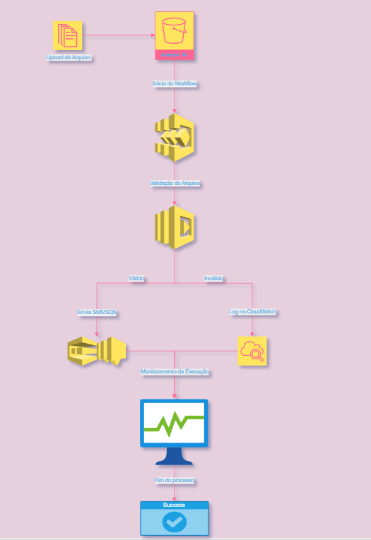

## 🔁 Diagrama da Arquitetura  

> 🧠 **Fluxo de Automação com AWS Step Functions**  
> O diagrama representa o processo de orquestração automatizada: o arquivo é enviado ao **Amazon S3**, o **Step Functions** inicia o workflow, aciona uma função **Lambda** para validação e, conforme o resultado, envia mensagens via **SNS/SQS** ou gera logs no **CloudWatch**. Todo o ciclo é monitorado até a conclusão bem-sucedida do processo.

Durante a prática, explorei o AWS Step Functions, um serviço de orquestração de fluxos de trabalho automatizados que permite integrar e coordenar diferentes serviços da AWS — como Lambda, S3, SNS, SQS e DynamoDB — de forma visual, escalável e com pouco código.

💡 Foram criados e executados workflows automatizados para:

✅ Validar arquivos

⚙️ Acionar funções Lambda

🔄 Coordenar a comunicação entre serviços

📊 Monitorar execuções e resultados

Essa experiência proporcionou uma visão prática sobre automação, mensageria e boas práticas de arquitetura em nuvem, reforçando o uso do Step Functions como ferramenta essencial em pipelines e aplicações distribuídas.

Objetivos de Aprendizagem

Ao concluir este desafio, foi possível:

Aplicar os conceitos aprendidos em um ambiente prático;

Documentar processos técnicos de forma clara e estruturada;

Utilizar o GitHub como ferramenta de documentação e compartilhamento técnico;

Consolidar o conhecimento sobre AWS Lambda e Step Functions.

⚙️ Tecnologias Utilizadas

AWS Step Functions

AWS Lambda

Amazon S3

Amazon SNS / SQS

AWS CloudWatch

Git & GitHub

🧠 Aprendizados

Durante o desafio, aprimorei habilidades relacionadas a:

Criação de workflows visuais usando o Step Functions;

Implementação de funções serverless com AWS Lambda;

Entendimento do fluxo de mensageria assíncrona com SNS e SQS;

Monitoramento e validação de execuções automatizadas;

Aplicação de boas práticas em arquitetura de nuvem.

🔁 Diagrama da Arquitetura

🧠 Fluxo de Automação com AWS Step Functions
O diagrama representa o processo de orquestração automatizada: o arquivo é enviado ao Amazon S3, o Step Functions inicia o workflow, aciona uma função Lambda para validação e, conforme o resultado, envia mensagens via SNS/SQS ou gera logs no CloudWatch. Todo o ciclo é monitorado até a conclusão bem-sucedida do processo.
